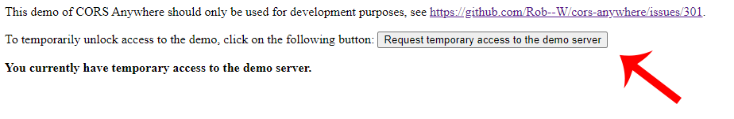

# React Podcast App

Demo project made by Pedro Iván Gazulla Giménez  

This web app is a podcast player that fetch podcasts from iTunes API and RSS feeds, and then plays the selected podcast tracks in a web audio player.  

## To run the App (dev mode)
Make sure you have Node.js installed.  

Download the source code from this repository.  
Extract the code to a directory.  
Open a terminal and enter to the project directory.  

Run:  
### `npm install`

Run:
### `npm start`

Open [http://localhost:3000](http://localhost:3000) to view it in the browser.  

Do not forget to press the green "CORS" button:  

And request temporal access to use the CORS proxy:

If you don't request temporary access to the CORS proxy you won't be able to fetch podcasts.
