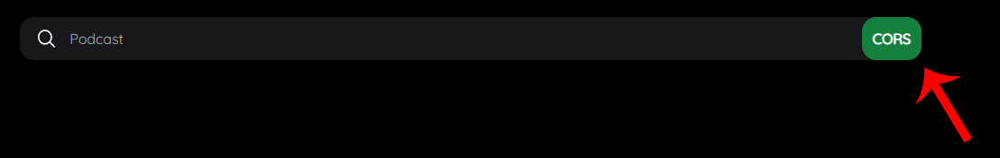

# React Podcast App

*Demo project made by Pedro Iván Gazulla Giménez*  
 
This web app is a podcast player that fetch podcasts from iTunes API and RSS feeds, then plays the selected podcast tracks in a web audio player.  
 
## To run the App (dev mode)
1. Make sure you have [Node.js](https://nodejs.org) installed.  
2. Download the source code from this repository.  
3. Extract the code to a directory.  
4. Open a terminal and enter to the project directory: "cd" command.  
5. Run: `npm install`
6. Run: `npm start`
7. Open [http://localhost:3000](http://localhost:3000) to view it in the browser.  
8. Do not forget to press the green "CORS" button:  

9. And request temporal access to use the CORS proxy:
  
If you don't request temporary access to the CORS proxy you won't be able to fetch podcasts.

